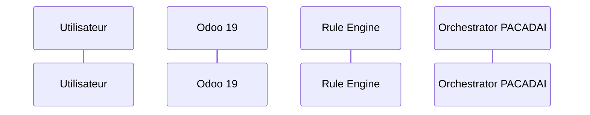

# 📐 ÉTAPE 3 : MODÉLISER — F001 Bloquer une vente non rentable

> Statut : 🔴 À compléter

## Diagramme de séquence

<!-- Insérer le diagramme Mermaid -->

## Acteurs et rôles

<!-- Lister les acteurs et leurs responsabilités -->

## Contrat de données (JSON)

<!-- Définir le payload échangé entre composants -->

## Règles anti-contournement

<!-- Transitions d'état autorisées, révocations, garde-fous -->

## 🚦 Gate de validation

- [ ] Le flux est dessiné
- [ ] Les acteurs et données sont définis
- [ ] Les règles anti-contournement sont intégrées
